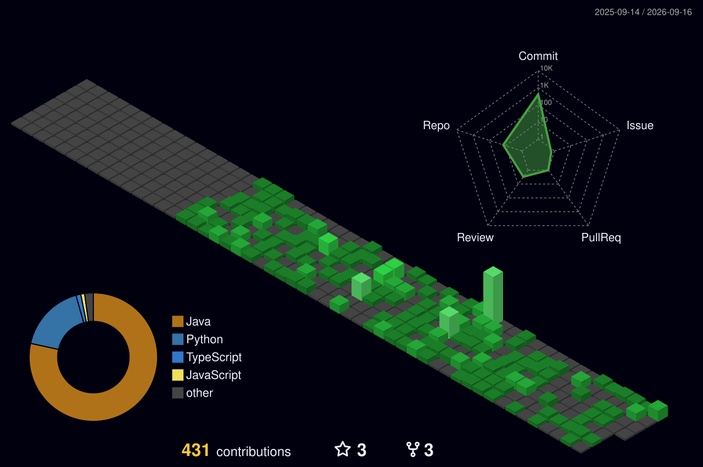

# Hi I'm NAGA SAI RAHUL VUDUMULA 

Application Developer at IBM Bangalore, specializing in AI-native AEM solutions and enterprise Java development. Adobe AEM Certified Professional (90%) with a passion for building scalable, production-ready systems. Published researcher (ICOECA 2024 Best Paper Award) and VIT-AP University graduate (B.Tech CSE - AI/ML, CGPA: 8.98/10.0) actively exploring opportunities in SDE, Full-Stack, and AI Engineering roles at product companies.

- 🏢 Application Developer @ IBM Bangalore (Nov 2025 – Present) — building AI-native AEM & Java solutions
- 🔭 Building AI-Powered AEM Orchestrator — reduced component dev time 2–3 hrs → 30–45 mins
- 🌱 Currently learning System Design (HLD/LLD), Distributed Systems, and Kafka
- 👯 Open to collaborate on Full-time roles in SDE / Full-Stack / AI at product companies
- 💼 Wanna collab on projects? reach me at: nagasairahulvudumula@gmail.com
- 💬 Ask me about AEM, OSGi, LangChain, RAG pipelines, Java, LLM Integration — happy to help!
- 🏆 Best Paper Award — ICOECA 2024 | Adobe AEM Certified (90%) | AWS Cloud Practitioner

  
  

## 🌐 Connect with me on:

# 💻 Tech Stack:

**Languages:**  

**AEM & Enterprise:**  

**AI/ML:**  

**Frontend:**  

**Cloud & DevOps:**  

**Tools:**  

# Recent Projects:

- **AI-Powered AEM Orchestrator** — [github.com/Rahul21sai](https://github.com/Rahul21sai) | IBM project featuring AI-generated AEM components, OSGi services, and Sling workflows from natural language. Figma exports directly scaffold AEM structures. XML watcher triggers automated Maven builds. Reduced scaffolding time from 2–3 hours to 30–45 minutes.

- **Facial Emotion Recognition using Hybrid CNN** — [github.com/Rahul21sai](https://github.com/Rahul21sai) | Ensemble of ResNet50 + VGG16 on FER2013 dataset achieving 90.2% validation accuracy across 7 universal emotions. Transfer learning with Gaussian noise regularization and data augmentation. Senior Design Project at VIT-AP University.

- **Anime Visage — GAN-Based Character Generator** — [github.com/Rahul21sai](https://github.com/Rahul21sai) | 95% accuracy in anime-style character generation using custom loss functions for style transfer. 75% inference time reduction via TensorFlow Lite optimization. **Best Paper Award at ICOECA 2024**.

- **Resume Studio — AI-Powered ATS Resume Tailoring Tool** — [github.com/Rahul21sai](https://github.com/Rahul21sai) | Accepts job description + master resume → generates ATS-optimized LaTeX resume. JD parsing, keyword extraction, section-level rewriting with end-to-end LLM API integration using Groq API.

- **Offline RAG-Based AI Assistant** — [github.com/Rahul21sai/RAG](https://github.com/Rahul21sai/RAG) | Air-gapped RAG system for private offline document querying. Benchmarked Llama-2, Mistral, Zephyr, Gemma on accuracy/latency. Modular ingestion pipelines supporting PDF, text, and structured formats.

- **Full-Stack Movie Booking Platform** — [github.com/Rahul21sai](https://github.com/Rahul21sai) | MERN stack application supporting 1000+ concurrent users with real-time seat selection. 30% increase in booking conversions via responsive UI design.

## GITHUB TROPHIES

  

  
  

  
  

## Achievements

# HacktoberFest

## Holopin Badges

## Github Contribution✨

<!-- Setup GitHub Action: see notes - requires peterjgrainger/action-create-branch + Platane/snk -->

## Rahul's Contribution Graph

  

## 3D Contribution Calendar 📅

<!-- Setup GitHub Action: see notes - requires github-readme-3d-contrib action to generate this file -->

### ✍️ Dev Quote

## 📄 Research & Certifications

**Research & Publications:**
- 🏆 **Best Paper Award** — "Anime Visage: Revealing Ingenuity with GAN-Assisted Character Development" — ICOECA 2024
- 📖 **Book Chapter** — "Utilizing AI and Machine Learning for Natural Disaster Management" — published on IGI Global
- 🚀 **Selected for ARAMBH 2024** entrepreneurship conference, Pune (engaged with 50+ startup founders & VCs)

**Certifications:**
- 📜 **Adobe Certified Professional – AEM Sites Developer (ADO-E128)** | Mar 2026–Mar 2028 | Score: **90%**
- ☁️ **AWS Certified Cloud Practitioner** | Amazon Web Services | 2024
- 🤖 **IBM Generative & Agentic AI Foundation** | IBM | Jan 2026
- 💡 **IBM Garage Essentials** (Agile, Design Thinking) | IBM | Jan 2026
- 🌐 **MERN Full Stack Development Certification** | 2023

**Leadership:**
- 👨‍💼 **Technical Lead** — Computer Society of India (CSI), VIT-AP | 2022–2025
  - Trained 100+ students, grew coding competition participation by 50%
  - Organized hackathons & tech talks, grew community engagement by 30%

**Previous Experience:**
- 🤖 **AI Model Contributor** @ Outlier | Nov 2024 – Mar 2025 | Remote Freelance
  - Evaluated LLM outputs (code generation, reasoning, instruction-following)
  - Quality assurance and failure pattern identification
